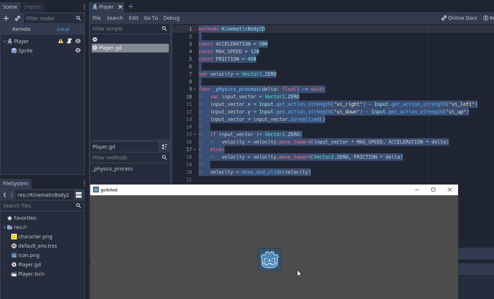

# Basic character movement implementation
#### This example was taken from [HeartBeast's Tutorial](https://www.youtube.com/watch?v=mAbG8Oi-SvQ&list=PL9FzW-m48fn2SlrW0KoLT4n5egNdX-W9a)

```gdscript
extends KinematicBody2D

const ACCELERATION = 500
const MAX_SPEED = 120
const FRICTION = 450

var velocity = Vector2.ZERO

func _physics_process(delta: float) -> void:
	var input_vector = Vector2.ZERO
	input_vector.x = Input.get_action_strength("ui_right") - Input.get_action_strength("ui_left")
	input_vector.y = Input.get_action_strength("ui_down") - Input.get_action_strength("ui_up")
	input_vector = input_vector.normalized()
	
	if input_vector != Vector2.ZERO:
		velocity = velocity.move_toward(input_vector * MAX_SPEED, ACCELERATION * delta)
	else:
		velocity = velocity.move_toward(Vector2.ZERO, FRICTION * delta)
	
	velocity = move_and_slide(velocity)
```

