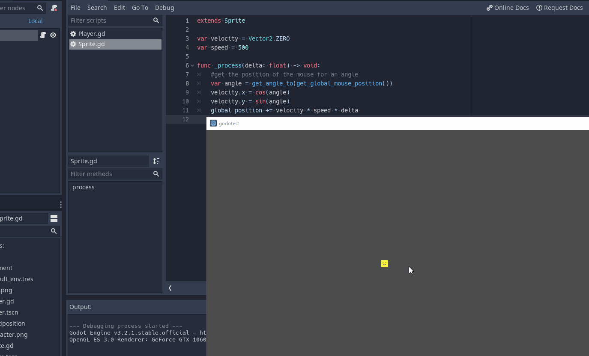

# Basic Move sprite towards a position
#### This example was taken from [HeartBeast's Tutorial](https://www.youtube.com/watch?v=os8mF3kbVCE)

###### In this case, it moves towards the mouse position

```gdscript
extends Sprite

var velocity = Vector2.ZERO
var speed = 500

func _process(delta: float) -> void:
	#get the position of the mouse for an angle
	var angle = get_angle_to(get_global_mouse_position())
	velocity.x = cos(angle)
	velocity.y = sin(angle)
	global_position += velocity * speed * delta
```

