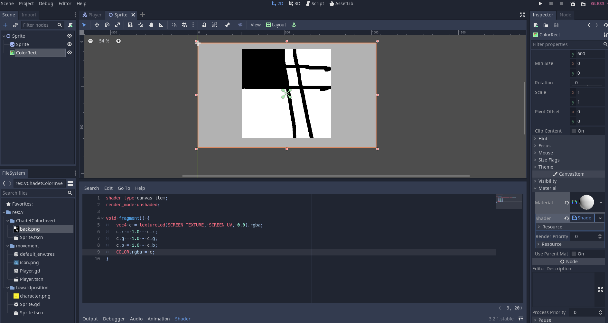

# ShaderInvert All Colors on Screen
#### This example was taken from [Parker Anderson's Tutorial](https://www.youtube.com/watch?v=aJ3pn3Mjorw)


```gdscript
shader_type canvas_item;
render_mode unshaded;

void fragment() {
	vec4 c = textureLod(SCREEN_TEXTURE, SCREEN_UV, 0.0).rgba;
	c.r = 1.0 - c.r;
	c.g = 1.0 - c.g;
	c.b = 1.0 - c.b;
	COLOR.rgba = c;
}
```

